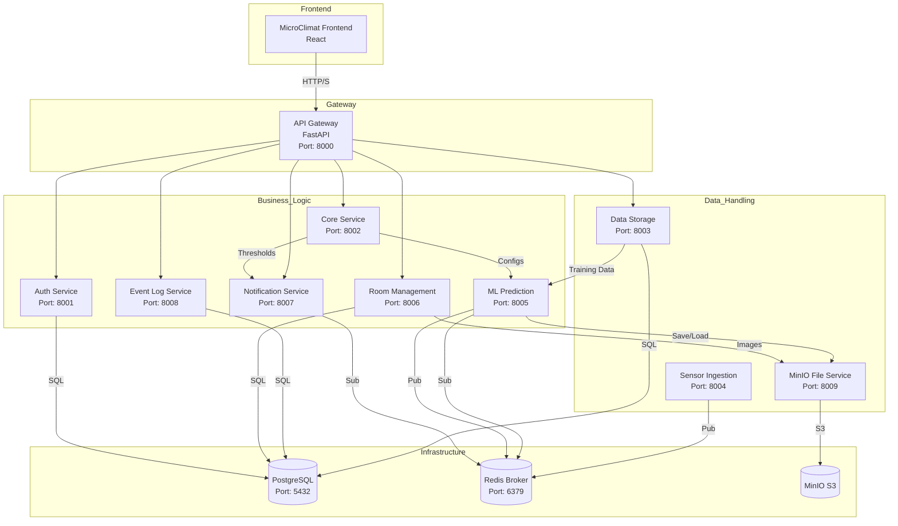

# Микросервисная архитектура для поддержания микроклимата

## 1. Обзор Си системы

Предлагаемая архитектура представляет собой микросервисную систему для мониторинга, управления и прогнозирования микроклимата в помещениях. Система будет использовать данные с датчиков, обучать модель машинного обучения для предсказания температуры и предоставлять пользователям расширенные возможности мониторинга и настройки.

## 2. Ключевые Требования

*   **Параметры микроклимата:** Мониторинг и контроль температуры и влажности с возможностью расширения.
*   **Предиктивное поддержание:** Обучение модели машинного обучения для предсказания температуры в помещении, дообучение на реальных данных.
*   **Пользовательский интерфейс:** Система ролей (Оператор, Администратор), мониторинг, настройка, визуализация (графики в реальном времени, планы помещений с датчиками, физическая модель для предсказания температуры), система уведомлений, управление событиями и уведомлениями, отображение статуса поверки датчиков.
*   **Логирование событий:** Централизованное логирование всех значимых системных событий, включая превышения уставок, статусы уведомлений (отправлено, принято в работу).
*   **Отслеживание поверки датчиков:** Учет сроков поверки датчиков и отображение статуса истекшей поверки в пользовательском интерфейсе.
*   **Технологии:** Backend на Python, Frontend на React, MinIO для хранения файлов, PostgreSQL в качестве основной базы данных, Redis как брокер сообщений.

## 3. Архитектура Микросервисов

Ниже представлена предлагаемая микросервисная архитектура и диаграмма, иллюстрирующая взаимодействие компонентов.

### 3.1. Список Микросервисов и их Ответственность

1.  **[`microclimat-frontend`](/MicroClimatFrontEnd)** (React):
    *   Пользовательский интерфейс для мониторинга, управления и конфигурации.
    *   Визуализация данных в реальном времени (графики, планы помещений).
    *   Административная панель для управления пользователями и помещениями.
    *   Отображение уведомлений и управление ими (принятие в работу, подтверждение).
    *   Отображение статуса поверки датчиков.

2.  **[`api-gateway`](/MicroClimatBackend/api-gateway)** (Python/FastAPI):
    *   Единая точка входа для всех клиентских запросов. (Порт: `8000`)
    *   Аутентификация и авторизация (делегирование `auth-service`).
    *   Маршрутизация запросов к соответствующим микросервисам.
    *   Ограничение скорости, логирование.

3.  **[`auth-service`](/MicroClimatBackend/auth-service)** (Python):
    *   Регистрация пользователей, вход в систему, управление сессиями. (Порт: `8001`)
    *   Управление ролями (Оператор, Администратор).
    *   Выдача и проверка токенов (JWT).
    *   Хранение учетных данных пользователей.

4.  **[`core-service`](/MicroClimatBackend/core-service)** (Python):
    *   Центральная бизнес-логика и системные настройки. (Порт: `8002`)
    *   Управление конфигурациями ML-моделей и пороговыми значениями (уставками).
    *   Кэширование часто используемых системных данных.
    *   Управление флагами функций (feature flags).

5.  **[`sensor-ingestion-service`](/MicroClimatBackend/sensor-ingestion-service)** (Python):
    *   Прием необработанных данных с датчиков. (Порт: `8004`)
    *   Валидация формата и целостности данных.
    *   Публикация проверенных данных в Redis (топик `sensor_data`).
    *   Сохранение данных через `data-storage-service`.

6.  **[`data-storage-service`](/MicroClimatBackend/data-storage-service)** (Python):
    *   Управление взаимодействием с базой данных PostgreSQL с использованием SQLAlchemy для ORM и построения связей. (Порт: `8003`)
    *   Хранение исторических данных датчиков, конфигураций, пользователей.
    *   Предоставление API для получения данных другими сервисами.
    *   Автоматическое восстановление и миграция данных: сервис при запуске проверяет состояние базы данных и при необходимости инициирует миграцию, восстанавливая структуру таблиц и загружая начальные данные из резервных копий в формате JSON.

7.  **[`ml-prediction-service`](/MicroClimatBackend/ml-prediction-service)** (Python):
    *   Подписка на `sensor_data` из Redis. (Порт: `8005`)
    *   Запуск ML-моделей для прогнозирования.
    *   Публикация прогнозов в Redis (топик `prediction_results`).
    *   Управление обучением и переобучением моделей.
    *   Хранение моделей в MinIO.
    *   Запрос данных из `data-storage-service` для обучения через API.

8.  **[`room-management-service`](/MicroClimatBackend/room-management-service)** (Python):
    *   Управление конфигурациями помещений и планировками. (Порт: `8006`)
    *   Привязка датчиков к помещениям.
    *   Хранение информации о поверке датчиков.

9.  **[`notification-service`](/MicroClimatBackend/notification-service)** (Python):
    *   Оценка правил для аномалий на основе уставок из `core-service`. (Порт: `8007`)
    *   Отправка уведомлений (email, push, in-app).
    *   Управление шаблонами уведомлений.

10. **[`event-log-service`](/MicroClimatBackend/event-log-service)** (Python):
    *   Централизованное логирование системных событий и аудита. (Порт: `8008`)
    *   Хранение истории инцидентов и действий операторов.

11. **[`minio-file-service`](/MicroClimatBackend/minio-file-service)** (Python/MinIO Client):
    *   Интерфейс для работы с объектным хранилищем MinIO (модели, изображения планов). (Порт: `8009`)

12. **[`db-postgresql`](/MicroClimatBackend/db-postgresql)** (PostgreSQL):
    *   Управление состоянием и схемой базы данных. (Порт: `5432`)

13. **[`redis-broker`](redis-broker.md)** (Redis):
    *   Pub/Sub для межсервисного взаимодействия. (Порт: `6379`)
    *   Уровень кэширования и очередь задач.

14. **[`rabbitmq`](rabbitmq.md)**
	-  

### 3.2. Архитектурная Диаграмма

## 4. План реализации (Todo List)

Подробный список задач будет вестись в основном Todo листе проекта.

## 5. Следующие шаги

1. Согласование обновленной архитектуры с учетом Core Service.
2. Детализация схемы базы данных.
3. Начало реализации базовых сервисов (Core, Data Storage).
